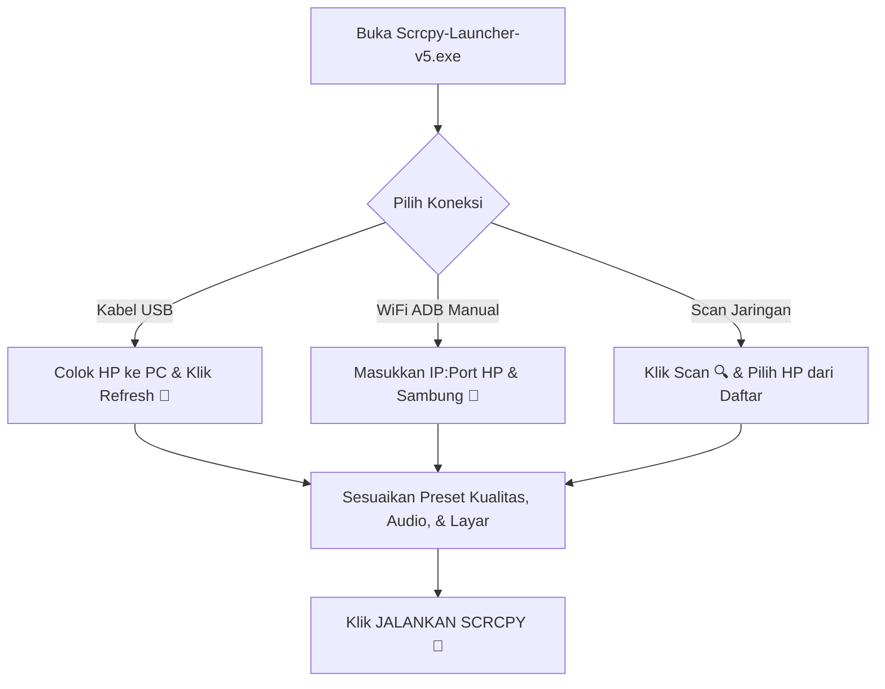

# 🚀 Scrcpy Pro Launcher v5.0 (Tauri Edition)

[](https://tauri.app/)
[](https://react.dev/)
[](https://github.com/Genymobile/scrcpy)
[](https://opensource.org/licenses/MIT)

**Scrcpy Pro Launcher v5.0** adalah aplikasi GUI desktop generasi terbaru yang ringan, cepat, dan modern untuk mengontrol perangkat Android dari PC Windows. Dibangun menggunakan **Tauri (Rust)**, **React**, dan **TypeScript**, aplikasi ini berfungsi sebagai pembungkus (*wrapper*) visual yang elegan untuk engine **scrcpy**.

---

## 📂 Struktur Berkas Pembantu

Berikut adalah berkas pendukung bawaan engine scrcpy dan kegunaannya yang berada di folder root:

| Berkas | Kegunaan | Status |
| :--- | :--- | :--- |
| **`Scrcpy-Launcher-v5.exe`** | **Executable Utama.** Aplikasi GUI launcher versi 5.0 siap pakai yang langsung meluncurkan antarmuka visual. | **Aktif/Digunakan** |
| **`scrcpy-launcher-v5/`** | **Folder Sumber Kode.** Folder proyek pengembangan berbasis Tauri + React + TypeScript. | **Aktif/Sumber Kode** |
| **`open_a_terminal_here.bat`** | Utilitas cepat untuk membuka jendela Command Prompt (`cmd.exe`) langsung di direktori kerja ini. | **Aktif/Pendukung** |
| **`scrcpy-console.bat`** | Script bawaan resmi `scrcpy` untuk menjalankan streaming manual via terminal. | **Aktif/Bawaan Scrcpy** |
| **`scrcpy-noconsole.vbs`** | Script bawaan resmi `scrcpy` untuk meluncurkan `scrcpy.exe` di latar belakang secara tersembunyi. | **Aktif/Bawaan Scrcpy** |

---

## 🛠️ Persyaratan Sistem & Instalasi

### Langkah 1: Persiapan pada Perangkat Android
1. Buka **Pengaturan** di HP Android Anda.
2. Masuk ke **Tentang Ponsel** (*About Phone*), lalu ketuk **Nomor Bentukan** (*Build Number*) sebanyak 7 kali hingga muncul pesan bahwa *Developer Options* (Pilihan Pengembang) telah aktif.
3. Buka **Pilihan Pengembang**, lalu aktifkan **Debugging USB** (*USB Debugging*).
4. *(Opsional untuk WiFi)* Hubungkan HP Anda ke jaringan WiFi yang sama dengan PC Anda.

### Langkah 2: Cara Menjalankan GUI Launcher
Aplikasi ini bersifat *portable* dan siap pakai. Anda tidak perlu memasang Node.js atau Rust untuk menjalankannya:
1. Pastikan seluruh berkas scrcpy (`scrcpy.exe`, `adb.exe`, dll.) berada di folder root yang sama.
2. Klik dua kali pada berkas:
   ▶️ **`Scrcpy-Launcher-v5.exe`**

---

## 💻 Panduan Pengembangan (Development)

Jika Anda ingin memodifikasi atau membangun ulang launcher dari kode sumber:

### Prasyarat
1. Pasang **Node.js** (versi 18 ke atas) dari [nodejs.org](https://nodejs.org/).
2. Pasang compiler **Rust** melalui toolchain [rustup.rs](https://rustup.rs/).

### Langkah Pengembangan
1. Masuk ke folder proyek launcher:
   ```bash
   cd scrcpy-launcher-v5
   ```
2. Pasang dependensi Node.js:
   ```bash
   npm install
   ```
3. Jalankan aplikasi dalam mode pengembangan (*live reload*):
   ```bash
   npm run tauri dev
   ```
4. Bangun/kompilasi aplikasi menjadi executable `.exe` mandiri baru:
   ```bash
   npm run tauri build
   ```
   *Hasil kompilasi `.exe` baru akan berada di folder `scrcpy-launcher-v5/src-tauri/target/release/`.*

---

## 🚀 Fitur Utama & Cara Penggunaan



### 1. Koneksi Perangkat
* **Kabel USB:** Colokkan HP ke PC dengan kabel data. Klik tombol **Refresh (🔄)** pada launcher untuk mendeteksi perangkat.
* **WiFi ADB (USB ke WiFi):** Hubungkan HP via USB terlebih dahulu. Klik tombol **Aktifkan WiFi ADB** pada GUI untuk mengisi alamat IP secara otomatis, setelah itu kabel USB dapat dilepas.
* **Scan Subnet (🔍 Scan):** Klik **Scan** untuk mendeteksi perangkat Android lain di jaringan WiFi lokal Anda yang port ADB-nya (5555) terbuka, lalu pilih dari daftar popup.

### 2. Kualitas Stream & Codec
* Gunakan pilihan preset kualitas cepat mulai dari **Rendah**, **Sedang**, **Tinggi**, hingga **2K** demi kelancaran streaming.
* Gunakan codec modern seperti **h265** atau **av1** jika HP dan PC Anda mendukung untuk menghemat data bandwidth saat koneksi via WiFi.

### 3. Multi-Tasking (Layar Virtual Android 13+)
* Buat layar virtual terpisah agar HP Anda dapat membuka aplikasi lain secara background sementara PC menampilkan aplikasi target (misal: Instagram/Game). Cukup centang **Aktifkan Layar Virtual** dan isi package name aplikasi yang ingin dijalankan.

### 4. Rekaman Layar & Profil
* Rekam aktivitas layar langsung ke format `.mp4` atau `.mkv` yang disimpan di direktori root.
* Simpan kombinasi konfigurasi favorit Anda ke dalam **Profil Pengaturan** agar dapat dimuat kembali secara instan di sesi berikutnya.

---

## ⚠️ Troubleshooting

> [!WARNING]
> **Error "adb.exe tidak ditemukan"**
> Pastikan executable `Scrcpy-Launcher-v5.exe` diletakkan di satu tingkat direktori yang sama dengan berkas engine scrcpy seperti `adb.exe`, `scrcpy.exe`, `scrcpy-server`, dan berbagai berkas `.dll`.

> [!IMPORTANT]
> **Otorisasi Kunci Kriptografi (Fingerprint)**
> Saat pertama kali menghubungkan perangkat ke komputer baru, pastikan untuk membuka layar HP Android Anda dan mengetuk **"Izinkan Debugging USB"** pada pesan dialog popup yang muncul.

---

**Dibuat dengan ❤️ oleh [aziz4212isx](https://github.com/aziz4212isx)**
