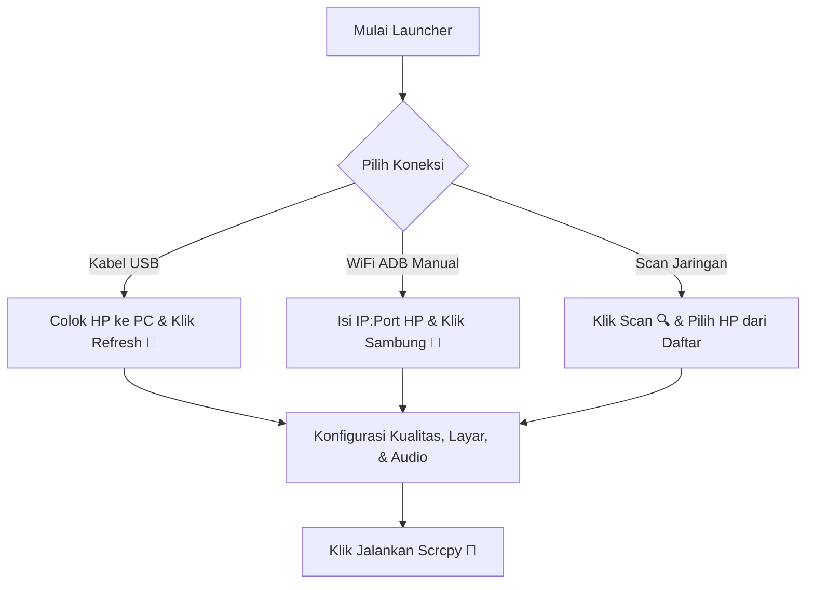

# 🚀 Scrcpy Pro Launcher v4.0

**Scrcpy Pro Launcher** adalah aplikasi GUI desktop modern dan kaya fitur yang dirancang untuk mengontrol perangkat Android dari PC Windows menggunakan engine **scrcpy**. Dibuat menggunakan pustaka *CustomTkinter*, launcher ini mempermudah konfigurasi, koneksi wireless (nirkabel), rekaman layar, hingga fitur multi-tasking layar virtual tanpa perlu mengetik perintah konsol secara manual.

---

## 📂 Penjelasan Berkas Batch (`.bat`) & Pembantu

Sebelum memulai, berikut adalah kegunaan dari berkas-berkas `.bat` dan `.vbs` yang ada di folder root:

| Berkas | Kegunaan | Status |
| :--- | :--- | :--- |
| **`Scrcpy-Modern-Launcher.bat`** | **Sangat Penting.** Script peluncur otomatis yang mendeteksi Python, memeriksa & menginstal dependensi (`customtkinter`, `sounddevice`, `pyinstaller`), mendeteksi jika ada perubahan pada kode sumber `scrcpy_launcher.py` untuk otomatis membangun kembali berkas `.exe`, lalu menjalankannya. | **Aktif/Digunakan** |
| **`open_a_terminal_here.bat`** | Shortcut instan untuk membuka jendela Command Prompt (`cmd.exe`) langsung di direktori kerja ini. Sangat berguna untuk kebutuhan debugging cepat. | **Aktif/Pendukung** |
| **`scrcpy-console.bat`** | Script bawaan resmi `scrcpy` untuk menjalankan streaming scrcpy manual via konsol dan menahan jendela terminal jika terjadi error. | **Aktif/Bawaan Scrcpy** |
| **`scrcpy-noconsole.vbs`** | Script VBScript bawaan resmi `scrcpy` untuk meluncurkan `scrcpy.exe` secara background tanpa menampilkan jendela hitam konsol di layar PC. | **Aktif/Bawaan Scrcpy** |

---

## 🛠️ Persyaratan Sistem & Instalasi

Ikuti langkah-langkah di bawah ini untuk mempersiapkan dan menjalankan launcher di komputer Anda.

### Langkah 1: Persiapan pada Perangkat Android
1. Buka **Pengaturan** di HP Android Anda.
2. Masuk ke **Tentang Ponsel** (*About Phone*), lalu ketuk **Nomor Bentukan** (*Build Number*) sebanyak 7 kali hingga muncul pesan bahwa *Developer Options* (Pilihan Pengembang) telah aktif.
3. Kembali ke Pengaturan utama, buka **Pilihan Pengembang**, lalu aktifkan **Debugging USB** (*USB Debugging*).
4. *(Opsional untuk WiFi)* Hubungkan HP Anda ke jaringan WiFi yang sama dengan PC Anda.

### Langkah 2: Instalasi Python di Windows (Jika belum terpasang)
Jika komputer Anda belum memiliki Python, instal terlebih dahulu:
1. Unduh penginstal Python resmi (versi 3.8 ke atas direkomendasikan) dari [python.org](https://www.python.org/downloads/).
2. **PENTING:** Selama proses instalasi, pastikan Anda mencentang opsi **"Add Python to PATH"** sebelum menekan tombol *Install Now*.

### Langkah 3: Menjalankan Aplikasi & Instalasi Otomatis
Anda tidak perlu menginstal dependensi Python secara manual. Cukup klik dua kali pada:
▶️ **`Scrcpy-Modern-Launcher.bat`**

Script ini akan secara otomatis melakukan:
1. Verifikasi instalasi Python pada PATH komputer Anda.
2. Memeriksa dan menginstal pustaka yang diperlukan (`customtkinter`, `sounddevice`, `pyinstaller`) secara otomatis melalui `pip`.
3. Membangun/mengompilasi kode program menjadi berkas executable `Scrcpy-Modern-Launcher.exe` secara lokal jika terdapat perubahan kode.
4. Menjalankan launcher utama.

---

## 🚀 Panduan & Fitur Penggunaan

> [!TIP]
> Semua konfigurasi yang Anda pilih pada GUI akan diperbarui secara langsung pada kolom **Pratinjau Perintah** (*Command Preview*) di bagian bawah. Anda bisa menyalinnya dengan tombol **Salin** (*Copy*) jika ingin menjalankannya di PC lain secara manual.

### 1. Metode Koneksi Perangkat
* **Kabel USB (Rekomendasi):** Colokkan HP ke PC dengan kabel data yang berkualitas. Klik tombol **Refresh (🔄)** pada launcher. Nama perangkat Anda akan muncul pada daftar dropdown.
* **WiFi ADB (USB ke WiFi):** Hubungkan HP via USB terlebih dahulu. Klik tombol **🌐 Aktifkan** pada bagian *WiFi ADB*. IP perangkat Anda akan terisi otomatis pada kolom IP:Port, setelah itu Anda dapat melepas kabel USB.
* **Koneksi Manual IP:** Masukkan alamat IP dan port perangkat Android Anda (misal: `192.168.1.15:5555`) secara manual pada kolom yang tersedia, kemudian klik **🔗 Sambung**.
* **Scan Jaringan Lokal (🔍 Scan):** Klik tombol **🔍 Scan** untuk memindai port adb (5555) di seluruh subnet lokal Anda. Pilih perangkat yang ditemukan dari daftar dialog popup untuk langsung menghubungkannya.
* **WiFi ADB HP Toggle (🟢 WiFi ADB: ON/OFF):** Tombol pintas untuk mengaktifkan atau mematikan fitur nirkabel langsung di pengaturan sistem HP Android Anda secara instan dari PC.

### 2. Kualitas & Resolusi Layar
* **Preset Cepat:** Pilih kualitas instan mulai dari **Rendah**, **Sedang**, **Tinggi**, hingga **2K** sesuai kemampuan spesifikasi PC dan kestabilan jaringan WiFi Anda.
* **Codec Video:** Mendukung pilihan codec modern **h264**, **h265**, dan **av1** (direkomendasikan memakai h265 atau av1 untuk performa nirkabel terbaik dengan bitrate rendah).

### 3. Sinkronisasi Audio & Perilaku Layar
* **Speaker Keluaran:** Mengarahkan suara streaming HP ke output audio PC tertentu (memerlukan pustaka `sounddevice`).
* **Perilaku:** Centang opsi seperti **Matikan Layar HP** (menghemat baterai HP saat dikontrol dari PC), **HP Tetap Menyala**, **Selalu di Atas**, atau **Hanya Lihat** (mode read-only tanpa interaksi mouse/keyboard).

### 4. Multi-Tasking (Layar Virtual Android 13+)
Fitur premium untuk membuat layar virtual kedua secara terpisah dari layar fisik HP Anda:
1. Centang **Aktifkan Layar Virtual**.
2. Masukkan nama aplikasi pada kolom *Buka Aplikasi* (misal: `instagram` untuk pencarian fuzzy, atau package name penuh seperti `com.instagram.android`).
3. Tekan **🚀 JALANKAN SCRCPY**. Aplikasi tersebut akan terbuka di jendela PC baru secara independen, sementara layar fisik HP Anda bebas digunakan untuk aktivitas lainnya.

### 5. Rekam Layar
* Centang opsi **Aktifkan Rekaman** dan tentukan format nama berkas tujuan (mendukung format `.mp4` atau `.mkv`). Rekaman video layar akan disimpan langsung di direktori yang sama setelah sesi scrcpy ditutup.

### 6. Profil Pengaturan
* Anda dapat menyimpan racikan konfigurasi favorit Anda. Masukkan nama profil pada kolom input, lalu klik **💾 Simpan**.
* Muat kembali profil kapan saja dengan memilihnya di dropdown dan mengeklik **📂 Muat**.

---

## ⚠️ Pemecahan Masalah (Troubleshooting)

> [!WARNING]
> **Muncul pesan "adb.exe tidak ditemukan di folder scrcpy!"**
> Pastikan berkas launcher `scrcpy_launcher.py` (atau versi `.exe`-nya) diletakkan di dalam folder yang sama dengan berkas bawaan paket scrcpy lainnya (seperti `adb.exe`, `scrcpy.exe`, dan file dll pendukung).

> [!IMPORTANT]
> **Koneksi WiFi ADB gagal atau terputus**
> 1. Pastikan HP dan PC berada pada router/Hotspot WiFi yang sama.
> 2. Pastikan Anda telah menyetujui izin dialog otorisasi kunci komputer (fingerprint dialog) pada layar HP Android saat pertama kali terhubung.
> 3. Apabila port 5555 tertutup, ulangi proses aktivasi menggunakan koneksi kabel USB terlebih dahulu dengan mengeklik tombol **🌐 Aktifkan** pada launcher.

---

**Dibuat dengan ❤️ oleh [aziz4212isx](https://github.com/aziz4212isx)**
